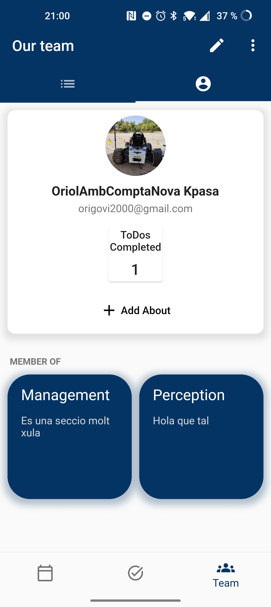

# BCNeMotorsportApp
Team App for BCN eMotorsport Formula Student team made using Flutter and compatible with **Android** and **IOS**.
The main objective of this app is to help manage the team's events and ToDo(s).

## Team hierarchy
Internally, the team is divided into sections, each section has a chief and there are X number of teamleaders, which take directive decisions.
This structure must be respected in the application, depending on the role each person has in the team, different permissions will be granted.
All the following features can be executed in-app.

- **Member:**
  - Create / modify ToDo(s)
  - Create an event for one of his sections

- **Chief:**
  - All member functions
  - Add / remove members from one of his sections
  - Create / modify all type of events
  - Create / modify an announcement

- **Teamleader:**
  - Grant / deny access to any team member
  - Create / modifiy sections

## Functionality

### ToDo(s)
A ToDo represents a thing that a person will do.

- It has the possibility to be shared, i.e. multiple persons will have the same thing to do. When a ToDo is shared, it will appear on every person's feed. There is also the possibility to send a notification to these.
- A ToDo has a priority (the app includes the possibility of sorting them accordingly), these are from more important to less:
  - We are late (LOL), in red
  - Fiu fiu, in orange
  - Better now, in yellow
  - Chill, green
- A ToDo can have a deadline, a progress bar will be shown on top of every ToDo pill.

There are two ToDo's feed-views, one for the ToDo(s) that belong to you and another that displays what every member from your section is doing.

   
  ToDo(s) feed-view

### Calendar
The app includes an event manager, functionalities are:
- An event will have a start date and an end date (with possibility to be an all-day event).
- An event will have a visibility level, it can be seen be everyone or by members of your section only.
- A notification can be sent to everyone who can see the event at creation.
- Different colors to differenciate event types.

   
  Calendar screen

### Announcements
An announcement is something that all members need to see and that is stored in a foldable panel with "Latest News" written.
This panel is designed as a stack, so the latest announcement will be more visible.

### Profile
Each member will have a profile (accessible via the team tab), this profile will show to anyone:
- Name
- Email
- Profile picture (changeable by the user)
- Number of ToDo(s) completed
- A description
- The sections he/she is member/chief of

   
  Profile screen

## Backend
Firebase Firestore is used to store **all** information that the app needs to work (no data is stored in-device).
This database system allows the app to make every change one user does to instantly send it and update all users information.

## Google login
In order to make things easier for the users, the app includes Google login.
That means that in order to access the app a teamleader must have ony added your email to the database in order for you to login using that google email.
Further security is added so only university mails (@estudiantat.upc.edu) can be added.
